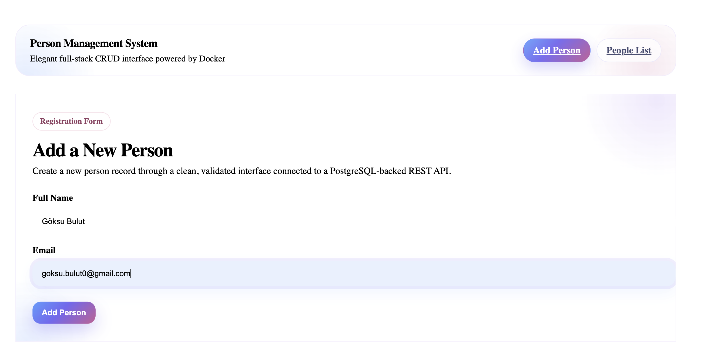
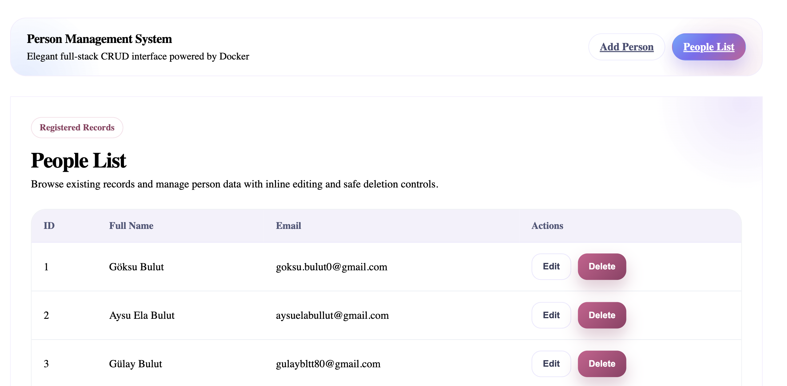
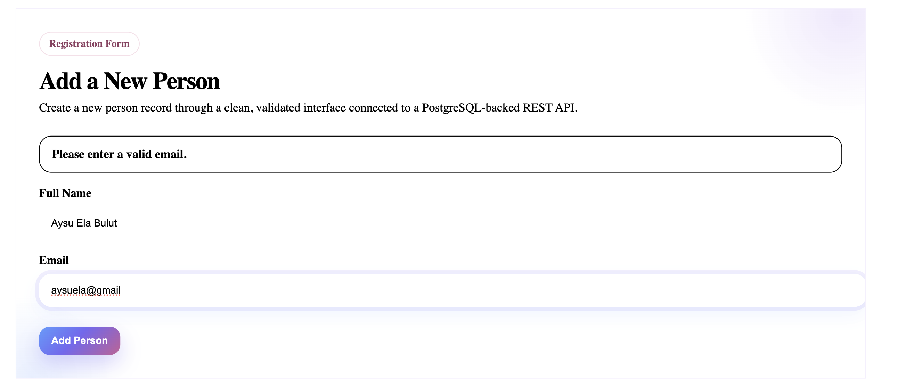
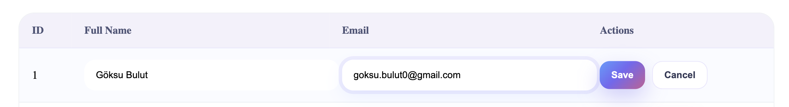

# Person Management App

A modern full-stack CRUD web application for managing person records.  
This project is built with **React**, **Express.js**, **PostgreSQL**, and **Docker Compose**.

The system allows users to create, view, update, and delete person records through a clean and responsive interface, while storing data persistently in a PostgreSQL database.

---

## Tech Stack

### Frontend
- React
- Vite
- JavaScript
- Fetch API

### Backend
- Node.js
- Express.js
- PostgreSQL client (`pg`)

### DevOps
- Docker
- Docker Compose

---

## Features

- Add a new person record
- View all registered people
- Update existing records
- Delete records with confirmation
- Client-side form validation
- Server-side validation
- Unique email constraint enforced in the database
- Dockerized multi-service architecture
- Modern and responsive user interface

---

## Project Structure

```text
person-management-docker/
│
├── backend/
│   ├── Dockerfile
│   ├── package.json
│   └── src/
│       ├── index.js
│       └── db.js
│
├── db/
│   └── init.sql
│
├── frontend/
│   ├── Dockerfile
│   ├── package.json
│   └── src/
│
├── .env.example
├── .gitignore
├── docker-compose.yml
└── README.md
Getting Started
Requirements

Make sure the following tools are installed on your machine:

Docker Desktop

Git

Clone the Repository
git clone https://github.com/goksubulut/person-management-docker.git
cd person-management-docker
Run the Application

Start the full system with:

docker compose up --build

This command starts all required services:

Frontend

Backend

PostgreSQL database

Application URLs
Frontend
http://localhost:5173
Backend Health Check
http://localhost:5070/api/health
REST API Endpoints
Method	Endpoint	Description
GET	/api/people	Get all people
GET	/api/people/:id	Get a single person by ID
POST	/api/people	Create a new person
PUT	/api/people/:id	Update an existing person
DELETE	/api/people/:id	Delete a person
Database

The PostgreSQL database is initialized automatically using:

db/init.sql
Table: people
Field	Type	Constraints
id	SERIAL	Primary Key
full_name	VARCHAR	NOT NULL
email	VARCHAR	NOT NULL, UNIQUE
Validation Rules

The application includes both frontend and backend validation.

Frontend Validation

Full Name cannot be empty

Email cannot be empty

Email must match a valid format

Backend Validation

Email format is validated

Email must be unique

Proper HTTP status codes are returned for errors

Docker Services

The application runs using three containers:

frontend → React application

backend → Express.js REST API

db → PostgreSQL database

### Home Page – Person Registration



### People List Page




### Wrong Mail format




### Edit



### Successful Deletion


