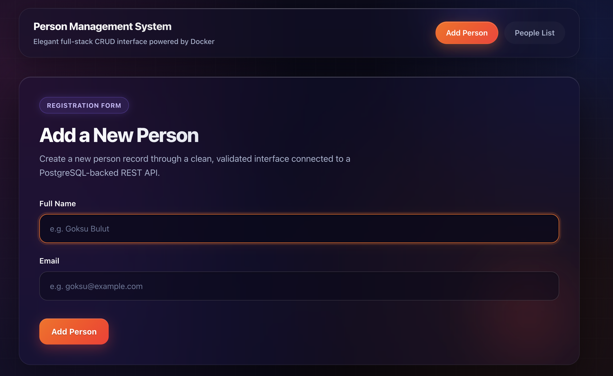
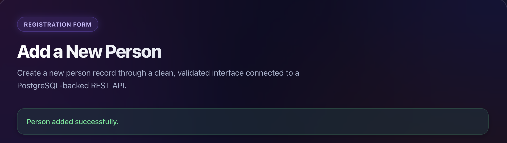
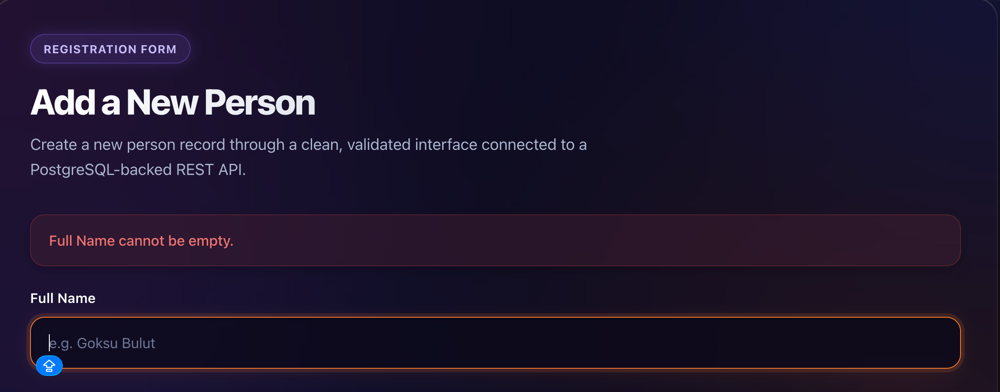
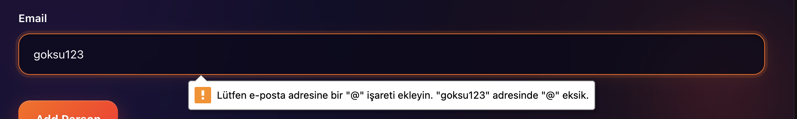
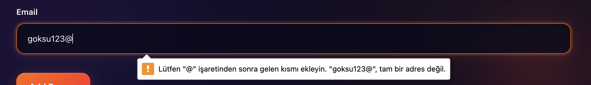
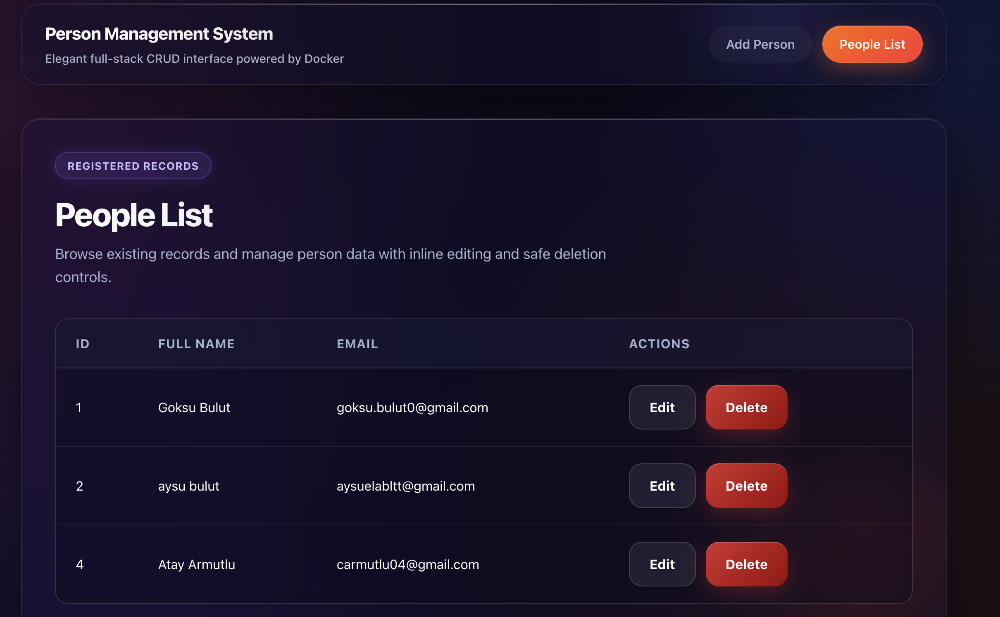
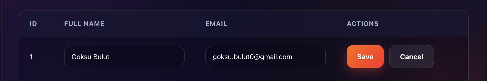
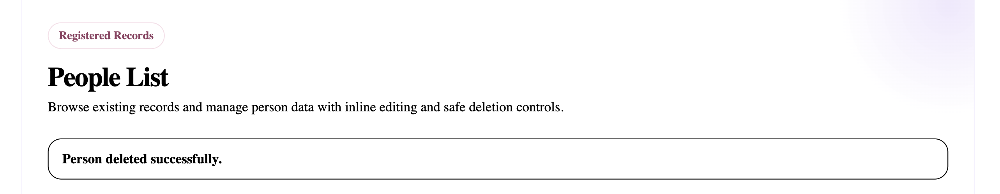

# Person Management App

A modern, full-stack CRUD web application for managing person records, newly updated with a premium dark-themed UI.  
This project is built with **React**, **Express.js**, **PostgreSQL**, and **Docker Compose**, strictly following containerized development best practices.

The system allows users to create, view, update, and delete person records through a visually stunning and responsive interface, while persistently storing data in a PostgreSQL database.

---

## Tech Stack

### Frontend
- **React** (via Vite)
- **Vanilla CSS** (Custom Glassmorphism Dark Theme)
- **JavaScript**
- **Fetch API**

### Backend
- **Node.js**
- **Express.js**
- **PostgreSQL Client** (`pg`)

### DevOps
- **Docker**
- **Docker Compose**

---

## Features

- **Premium UI:** Next-generation dark theme with glassmorphism, dynamic gradients, and micro-animations.
- **Full CRUD:** Create, view, update, and delete person records.
- **Data Integrity:** Client-side and server-side validation ensuring clean inputs and unique email constraints.
- **Dockerized Architecture:** Multi-container setup for true "one-command" deployments.

---

## Getting Started

### Requirements
Ensure the following tools are installed on your machine:
- [Docker Desktop](https://www.docker.com/products/docker-desktop)
- [Git](https://git-scm.com/)

### Clone the Repository
```bash
git clone https://github.com/goksubulut/person-management-docker.git
cd person-management-docker
```

### Run the Application

Start the entire system using Docker Compose. This single command will build the images and spin up the Frontend, Backend, and PostgreSQL database simultaneously:

```bash
docker compose up --build
```

---

## Application URLs

| Service | Address |
|---------|---------|
| **Frontend UI** | [http://localhost:5173](http://localhost:5173) |
| **Backend Health Check** | [http://localhost:5070/api/health](http://localhost:5070/api/health) |

### REST API Endpoints

| Method | Endpoint | Description |
|--------|----------|-------------|
| `GET` | `/api/people` | Retrieve all person records |
| `GET` | `/api/people/:id` | Retrieve a single person by ID |
| `POST` | `/api/people` | Create a new person |
| `PUT` | `/api/people/:id` | Update an existing person by ID |
| `DELETE`| `/api/people/:id` | Delete a person by ID |

---

## Database Schema

The PostgreSQL database is initialized automatically upon the first Docker run using the `db/init.sql` script.

**Table:** `people`

| Field | Type | Constraints |
|-------|------|-------------|
| `id` | `SERIAL` | Primary Key |
| `full_name` | `VARCHAR` | `NOT NULL` |
| `email` | `VARCHAR` | `NOT NULL`, `UNIQUE` |


---

## Screenshots

### Home Page - Premium Dark Theme


### Success Notification


### Validation Errors







### People List - Data Management & Editing





### Delete Confirmation

